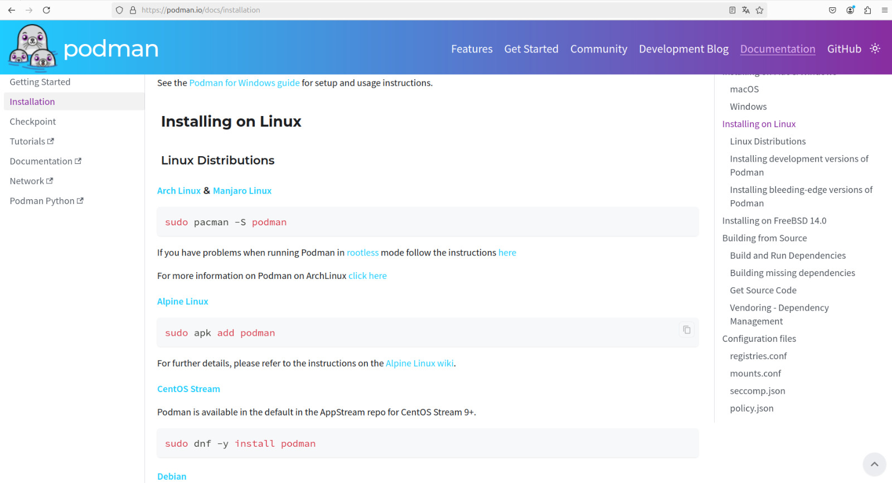
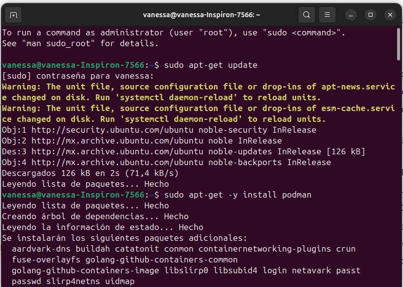
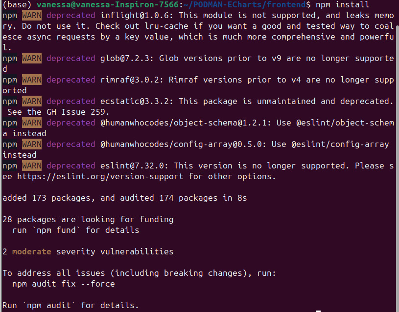
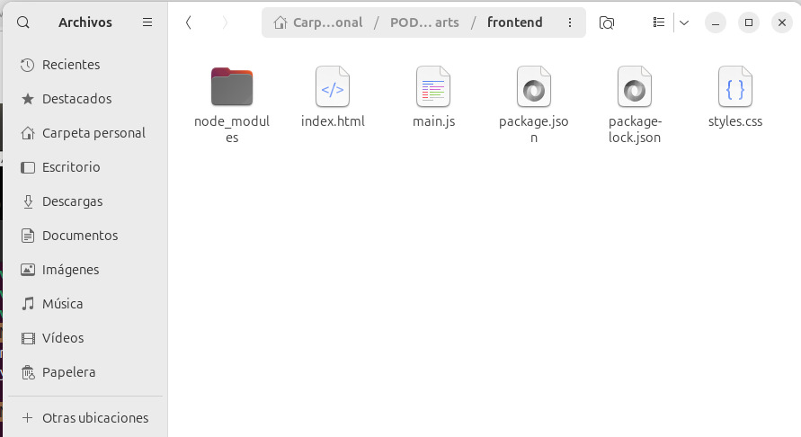
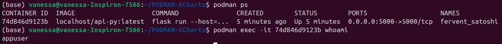
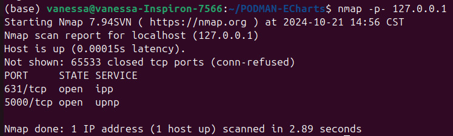
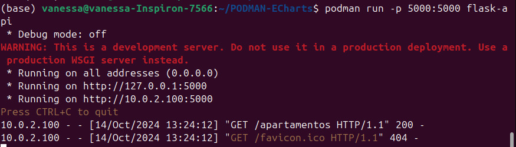
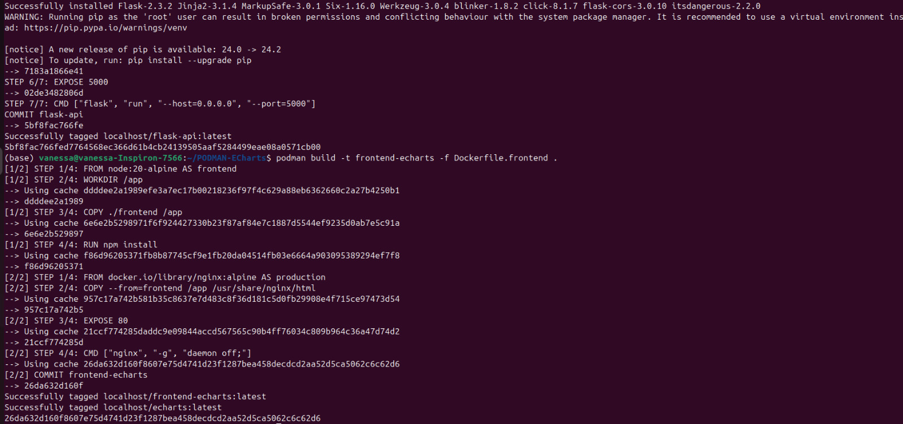
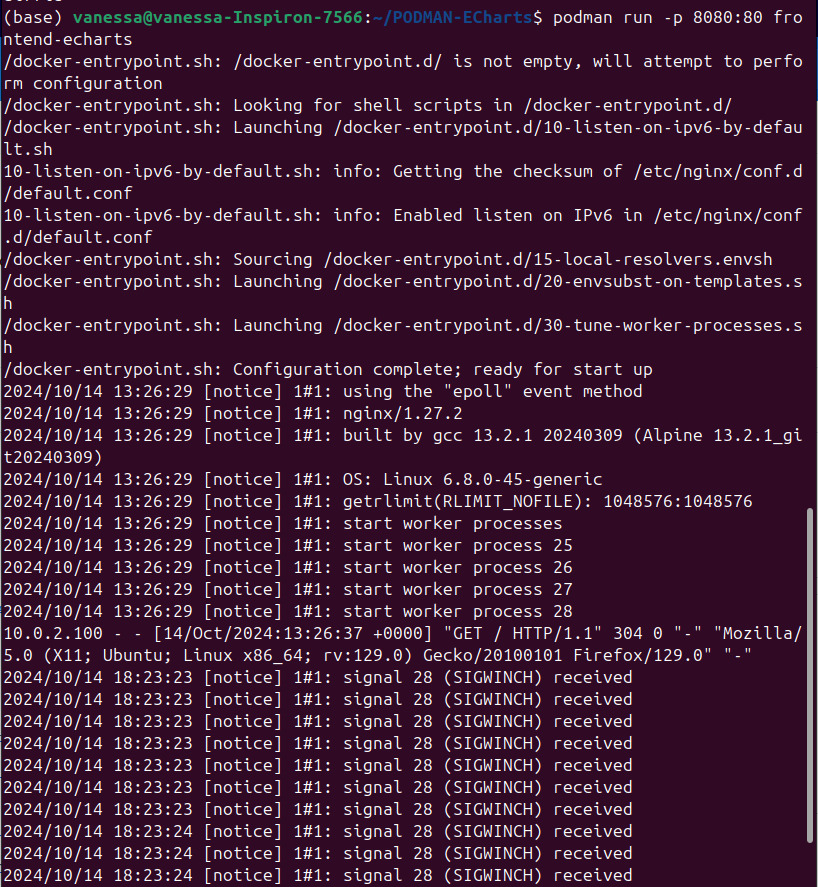
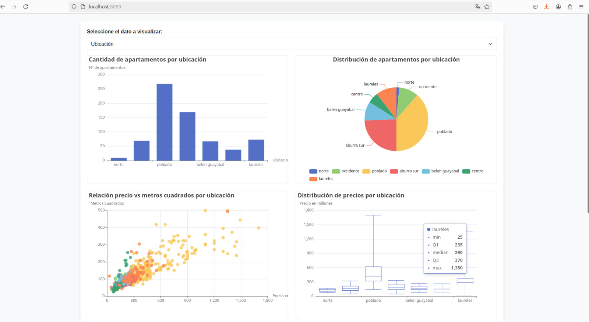

# Documentación del Proyecto ECharts

## Índice
1. [Introducción](#introducción)
2. [Estructura del Proyecto](#estructura-del-proyecto)
3. [Requisitos del Sistema](#requisitos-del-sistema)
4. [Instalación de Podman y npm](#instalación-de-podman-y-npm)
5. [Contenedores en Podman](#contenedores-en-podman)
   - [Creación del Contenedor para Backend](#creación-del-contenedor-para-backend)
     - [Explicación del código](#explicación-del-código-backend)
     - [Optimización del rendimiento](#optimización-del-rendimiento-backend)
     - [Seguridad](#seguridad-backend)
     - [Pruebas de seguridad](#pruebas-de-seguridad)
   - [Creación del Contenedor para Frontend](#creación-del-contenedor-para-frontend)
     - [Explicación del código](#explicación-del-código-frontend)
     - [Optimización del rendimiento](#optimización-del-rendimiento-frontend)
     - [Seguridad](#seguridad-frontend)
6. [Archivos del Proyecto](#archivos-del-proyecto)
   - [Backend](#backend)
     - [requirements.txt](#requirementstxt)
     - [app.py](#apppy)
     - [apartamentos.json](#apartamentosjson)
   - [Frontend](#frontend)
     - [package.json](#packagejson)
     - [package-lock.json](#package-lockjson)
     - [styless.css](#stylescss)
     - [main.js](#mainjs)
     - [index.html](#indexhtml)
9. [Conclusión](#conclusión)

## Introducción
Este proyecto tiene como objetivo la visualización de datos estadísticos y geoespaciales utilizando **ECharts** desde un contenedor creado en **Podman**. Los contenedores tienen el beneficio de ser escalables y seguros, por lo que, su utilización en este proyecto será viable puesto a que se recibirá un gran volumen de datos. 

## Estructura del Proyecto
El proyecto está dividido en dos carpetas principales:

- **frontend**: Contiene los archivos HTML, CSS y JavaScript (ECharts) necesarios para la visualización de las gráficas.
- **backend**: Contiene la API en Flask que proporciona los datos a la aplicación frontend, así como un archivo JSON para la lectura de los datos.

## Requisitos del Sistema
Para ejecutar este proyecto, son necesarios los siguientes requisitos:

- **Podman**: Para la creación y gestión de contenedores.
- **Node.js** y **npm**: Para gestionar las dependencias del frontend.
- **Python**: Para ejecutar la API de Flask.

## Instalación de Podman y npm

Para instalar podman, se necesitaron varios comandos los cuales se consiguieron en su sitio oficial:



y se procedieron a colocar en la terminal, tal y como se muestra a continuación:

Para verificar su correcta instalación se procedió a solicitar la versión de Podman (si no muestra la versión es porque no esta instalado).


*Instalación de npm*

Al momento de haber finalizado con la instalación del npm, este creará el archivo package-lock.json y la carpeta node_modules.

## Contenedores en Podman

### Creación del Contenedor para Backend
1. **Archivo Dockerfile.backend**:
   Este archivo define la imagen del contenedor para el backend. Cuenta 
   ```
    FROM python:3.11-alpine AS backend
    RUN addgroup -S appgroup && adduser -S appuser -G appgroup
    WORKDIR /app
    COPY ./backend/requirements.txt /app/
    RUN pip install --no-cache-dir -r requirements.txt
    COPY ./backend /app
    RUN chown -R appuser:appgroup /app
    USER appuser
    EXPOSE 5000
    CMD ["flask", "run", "--host=0.0.0.0", "--port=5000"]
   ```
   #### Explicación del código backend

    + **FROM python:3.11-alpine AS backend**: se utiliza una imagen base oficial de Python 3.11 sobre Alpine Linux. ALpine es una distribución minimalista y optimizada para contenedores, lo que reduce el tamaño de la imagen y mejora el **rendimiento**.
    + **RUN addgroup -S appgroup && adduser -S appuser -G appgroup**: Se crea un grupo llamado appgroup y un usuario sin privilegios llamado appuser dentro de ese grupo. El uso del indicador -S crea un usuario y grupo de sistema, lo que evita la asignación de privilegios innecesarios.
    + **WORKDIR /app**: establece el directorio de trabajo en */app*, es decir, todas las operaciones siguientes, como la copia de archivos, ocurrirán en este directorio dentro del contenedor.

        **Beneficio**: organiza mejor los archivos y define un punto de referencia claro para la aplicación.
    + **COPY ./backend/requirements.txt /app/**: copia el archivo requirements.txt (donde se definen las dependencias de Python) desde el host al directorio */app/* en el contenedor.
    + **RUN pip install --no-cache-dir -r requirements.txt**: instala las dependencias de Python especificadas en el archivo *requirements.txt* utilizando *pip*, y el argumento *--no-cache-dir* impide que se almacene en caché el contenido de los paquetes instalados.
    + **COPY ./backend /app**: copia todo el contenido del directorio *backend* (donde está la API y los archivos de la aplicación) desde el host al contenedor dentro del directorio */app/*.
    + **RUN chown -R appuser:appgroup /app**: cambia el propietario de todos los archivos y carpetas en el directorio */app* al usuario *appuser* y grupo *appgroup* creados previamente.
    + **USER appuser**: especifica que todas las operaciones restantes se ejecutarán como el usuario *appuser* en lugar de root, lo que refuerza la seguridad.
    + **EXPOSE 5000**: informa a Podman que el contenedor utilizará el puerto 5000, que es el puerto predeterminado en el que Flask ejecuta la aplicación.
    + **CMD ["flask", "run", "--host=0.0.0.0", "--port=5000"]**: este es el comando que se ejecuta cuando se inicia el contenedor. inicia el servidor Flask y lo hace accesible a través de la dirección IP 0.0.0.0 (lo que significa que puede recibir tráfico desde cualquier dirección) en el puerto 5000.
  
#### Optimización del rendimiento backend
    + **Minimización de tamaño con Alpine**: la imagen *Alpine* es mucho más ligera que otras distribuciones de Linux, lo que reduce el tamaño del contenedor y mejora los tiempos de descarga e inicio.
    + **No caché en la instalación de dependencias**: La instrucción *pip install --no-cache-dir* evita el almacenamiuento en caché de los paquetes de Python, lo que reduce el tamaño del contenedor y evita que se acumulen archivos innecesarios.
    + **Compresión de datos**: las imágenes de Alpine vienen con bibliotecas que suelen ser más eficaces en términos de almacenamiento, y muchas veces se utiliza una capa comprimida de las imágenes. Esto ayuda a minimizar el uso de espacio en disco.
    + **Capas de construcción optimizadas**: al copiar primero solo el archivo *requirements.txt* y luego instalar las dependencias antes de copiar el resto de la aplicación, se optimiza el caché de las capas de Podman. Esto significa que si solo cambia el código fuente pero no las dependencias, Podman no volverá a instalar todas las dependencias, acelerando la reconstrucción del contenedor.

#### Seguridad backend
    + **Ejecución como usuario sin privilegios**: ejecutar el contenedor como el usuario *appuser* meora la seguridad al evitar que la aplicación tenga acceso a permisos elevados.
    + **Restricción de permisos**: se aseguran los permisos correctos para que solo el usuario designado pueda acceder y ejecutar la aplicación en */app*.

#### Pruebas de seguridad

    1. **Verificación de usuario**: con el comando *podman exec -it IṔ-contenedor whoami* se busca verificar que el usuario sea appuser y no root, *podman exec* ejecuta un comando de un contenedor que ya esta en ejecución, *-it* son dos operaciones combinadas '-i' significa interactivo y este permite la entrada estándar del contenedor permanezca abierta y '-t' significa terminal, *IP-contenedor* se reemplaza por la IP del contenedor en ejecución y *whoami* devuelve el nombre del usuario actual que está ejecutando el proceso.

    

    2. **Verificación de puertos abiertos**: con el comando *nmap -p- 127.0.0.1* se utiliza para escanear los puertos de la dirección IP local (localhost). *nmap* permite descubrir dispositivos en la red y sus servicios. *-p-* argumento para que nmap escanee todos los puertos en busca de servicios que estén escuchando.

    

    Con esto podemos verificar que el puerto 5000 es el que solo esta abierto para que funcione la api Flask (el 631/tcp es para ipp, no se pudo cerrar).

2. **Construcción del contenedor**: Se deberá ejecutar el siguiente comando en la terminal para construir el contenedor del backend.

    ```
    podman build -t flask-api -f Dockerfile.backend .
    ```
    Para ejecutarlo, se deberá agregar el comando:
    ```
    podman run -p 5000:5000 flask-api
    ```
    Mostrandose de la siguiente manera en la terminal:

    

    Para verificar que la API esta ejecutándose en el navegador se deberá acceder a las rutas que muestra en la terminal y se le deberá agregar "/apartamentos", tal y como se muestra en la siguiente imagen: 

    

### Creación del Contenedor para Frontend
1. **Archivo Dockerfile.frontend**:
   Este archivo define la imagen del contenedor para el frontend.
   ```
    FROM node:20-alpine AS frontend
    WORKDIR /app
    COPY ./frontend/package*.json ./
    RUN npm ci --no-optional
    COPY ./frontend /app
    RUN npm run build
    FROM docker.io/library/nginx:alpine AS production
    RUN apk add --no-cache libcap
    RUN adduser -D -g 'nginx' nginxuser
    COPY --from=frontend /app/dist /usr/share/nginx/html
    RUN chown -R nginxuser:nginxuser /usr/share/nginx/html
    RUN setcap 'cap_net_bind_service=+ep' /usr/sbin/nginx
    EXPOSE 80
    CMD ["nginx", "-g", "daemon off;"]
   ```
   #### Explicación del código frontend

   + **FROM node:20-alpine AS frontend**: utiliza node:20-alpine, que es una imagen ligera de Node.js basada en Alpine Linux.
   + **WORKDIR /app**: establece */app* como el directorio de trabajo dentro del contenedor.
   + **COPY ./frontend/package*.json ./**: copia *package.json* y package-lock.json* al contenedor. Esto es fundamental para instalar las dependencias específicadas en estos archivos.
   + **RUN npm ci --no-optional**:  utiliza *npm ci* para instalar las dependencias de forma limpia y rápida, asegurando que se instalen exactamente las versiones indicadas en *package-lock.json*. Esto contriuye a la optimización del rendimiento y la estabilidad de la aplicación.
   + **COPY ./frontend /app**: esta acción permite que todo el código fuente del frontend esté disponible en el contenedor.
   + **RUN npm run build**: ejecuta el script *build* definido en package.json, lo cual normalmente compila el código fuente de la aplicación y genera archivos estáticos listos para la producción.
   + **FROM docker.io/library/nginx:alpine AS production**: se selecciona una imagen de Nginx también basada en Alpine para servir los archivos estáticos generados en la etapa anterior.
   + **RUN apk add --no-cache libcap**: instala *libcap* que se utiliza para establecer capacidades específicas en el contenedor, como permitir que Nginx escuche en el puerto 80.
   + **RUN adduser -D -g 'nginx' nginxuser**: crea un usuario que no tiene privilegios, lo que reduce el riesgo de comprometer el contenedor.
   + **COPY --from=frontend /app/dist /usr/share/nginx/html**: copia los archivos generados por el frontend al directorio donde Nginx servirá los archivos.
   + **RUN chown -R nginxuser:nginxuser /usr/share/nginx/html**: cambia la propiedad de los archivos servidos a *nginxuser*, asegurando que solo este usuario tenga acceso a esos archivos.
   + **RUN setcap 'cap_net_bind_service=+ep' /usr/sbin/nginx**: permite que Nginx escuche en el puerto 80 sin ser ejecutado como root, mejorando la seguridad del contenedor.
   + **EXPOSE 80**: indica que el contenedor escucha en el puerto 80, el puerto estándar para HTTP.
   + **CMD ["nginx", "-g", "daemon off;"]**: inicia Nginx en primer plano, lo cual es necesario para que el contenedor permanezca en ejecución.

2. **Archivo nginx.conf**:
   Es la configuración de Nginx, un servidor web. Define cómo debe manejar las solicitudes, especifica la ubicación de los archivos estáticos, establece políticas de compresión y caché, e implementa medidas de seguridad para proteger la aplicación web.
   ```
    worker_processes auto;

    events {
        worker_connections 1024;  # Número máximo de conexiones simultáneas por proceso de trabajo
    }

    http {
        gzip on;
        gzip_types text/plain application/javascript text/css application/json application/xml text/xml image/svg+xml;
        gzip_min_length 256;
        gzip_vary on;
        gzip_proxied any;

        server {
            listen 80;
            server_name localhost; 

            location / {
                root /usr/share/nginx/html;  # Ruta a los archivos estáticos
                index index.html index.htm;
                try_files $uri $uri/ /index.html;  # Soporte para Single Page Application (SPA)
            }

            error_page 404 /404.html;
            location = /404.html {
                internal;
            }

            add_header X-Content-Type-Options nosniff;
            add_header X-Frame-Options SAMEORIGIN;
            add_header X-XSS-Protection "1; mode=block";
            add_header Referrer-Policy no-referrer; 

            client_max_body_size 16M;

            types {
                text/html html;
                text/css css;
                application/javascript js;
                image/svg+xml svg;
                application/json json;
            }

            location ~* \.(js|css|html|png|jpg|jpeg|gif|ico|svg)$ {
                expires 1y;  # Caché por 1 año
                add_header Cache-Control "public";  # Control de caché
            }
        
    }
   ```
   #### Explicación del código:

   + **worker_processes auto**: ajusta automáticamente el número de procesos de trabajo según la cantidad de núcleos de CPU disponibles, mejorando el rendimiento.
   + **worker_connections 1024**: permite hasta 1024 conexiones simultáneas por proceso, optimizando el manejo de múltiples solicitudes.
   + **Compresión Gzip**: se habilita para tipos de archivoss específicos, reduciendo el tamaño de los datos transferidos y mejorando los tiempos de carga.
   + **Puerto y nombre del servidor**: configura el servidor para escuchar en el puerto 80 y permite el acceso desde localhost.
   + **Ubicación de archivos estáticos**: define la raíz de los archivos estáticos y utiliza try_files para manejar rutas de aplicaciones de una sola página (SPA).
   + **Manejo de errores**: proporciona una página de error 404 personalizada para mejorar la experiencia del usuario.
   + **Cabeceras de seguridad**: implementa cabeceras que protegen contra vulnerabilidades comunes, como inyección de scripts y ataques de "clickjacking".
   + **Límites y MIME Types**: establece un límite en el tamaño de las solicitudes y define los tipos MIME que Nginx debe reconocer y servir.
   + **Configuración de Caché**: establee políticas de caché para archivos estáticos, mejorando el rendimiento al reducir la necesidad de descargar archivos repetidamente.

#### Optimización del rendimiento frontend

+ La elección de node:20-alpine y nginx:alpine asegura un entorno ligero y eficiente, ideal para aplicaciones web modernas que utilizan herramientas de análisis y visualización de datos.
+ La etapa de construcción del frontend genera archivos estáticos optimizados para producción. La habilitación de la compresion Gzip reduce el tamaño de las respuestas HTTP, mejorando los tiempos de carga. Además, la configuración de caché permite que los archivos estáticos se almacenen en el navegador del usuario, disminuyendo la carga en el servidor y acelerando la aplicación.

#### Seguridad frontend

+ El contenedor se ejecuta con un usuario no privilegiado y permite que Nginx escuche en el puerto 80 sin usar permisos de root lo que mejora la seguridad. Las cabeceras de seguridad implementadas protegen contra varias vulnerabilidades comunes en aplicaciones web, y el límite de tamaño de solicitudes protege el servidor de ataques de denegación de servicio (DoS).


3. **Construcción del contenedor**: similar al backend, el siguiente comando construye el contenedor del frontend:
    ```
    podman build -t frontend-echarts -f Dockerfile.frontend .
    ```
    
    Para ejecutarlo, se deberá agregar el comando:
    ```
    podman run -p 8080:80 frontend-echarts
    ```
    

    Al acceder desde el navegador al contenedor por el puerto 8080 se podrán visualizar las gráficas 

    

## Archivos del Proyecto

### Backend
Omitiendo el archivo py donde se genera la API y el archivo json (los cuales se explicaron en la documentación anterior), se explicarán los archivos nuevos para el contenedor.
#### requirements.txt
Contiene las dependencias necesarias para el backend.

    ```
    Flask==2.2.3
    Flask-Cors==3.0.10
    Flask-Compress==1.13
    Werkzeug==2.3.2
    ```
#### app.py
Contiene las dependencias necesarias para el backend.

    ```
    from flask import Flask, jsonify
    from flask_cors import CORS
    from flask_compress import Compress
    import json

    app = Flask(__name__)
    app.config['MAX_CONTENT_LENGTH'] = 16 * 1024 * 1024  # Límite (16MB)
    app.config['CORS_HEADERS'] = 'Content-Type'
    app.config['COMPRESS_ALGORITHM'] = 'gzip'
    app.config['COMPRESS_LEVEL'] = 6  # Nivel de compresión obteniendo buen equilibrio entre velocidad y tamaño.

    compress = Compress(app)
    cors = CORS(app, origins=['http://localhost:8080'])

    # API utilizando FLASK
    @app.route('/apartamentos', methods=['GET'])
    def get_data():
        try:
            with open('apartamentos.json', 'r', encoding='utf-8') as json_file:
                data = json.load(json_file)

            # Asegúrate de que esto sea un array
            if not isinstance(data, list):
                return jsonify({"error": "El archivo JSON debe contener una lista de apartamentos"}), 500

            return jsonify(data)
        
        except FileNotFoundError:
            return jsonify({"error": "Archivo no encontrado"}), 404
        except json.JSONDecodeError:
            return jsonify({"error": "Error al decodificar el JSON"}), 500

    if __name__ == '__main__':
        app.run(host='0.0.0.0', port=5000, debug=False)
 
    ```
#### apartamentos.json
Archivo JSON con todos los datos de los apartamentos.

### Frontend
Omitiendo los archivos HTML, JS y CSS (los cuales se explicaron en la anterior documentación), se explicarán el nuevo archivo para el contenedor
#### package.json
Archivo que gestiona las dependencias y scripts del frontend:

    ```
    "name": "echarts",
    "version": "1.0.0",
    "description": "Proyecto de visualización de datos con ECharts",
    "scripts": {
        "start": "http-server ."
    },
    "dependencies": {
        "echarts": "^5.4.0"
    },
    "license": "MIT"
    }
    ```

## Conclusión
Este proyecto está enfocado en la creación de contenedores tanto para ECharts (que crea visualizaciones de datos interactivas) como para la API Flask (que obtiene los datos de un JSON para que puedan ser utilizados en ECharts) y en cómo gestionar contenedores de manera eficiente utilizando Podman. Me resultó más complicado trabajar con los contenedores, ya que me surgieron muchos problemas en cuanto a la seguridad, pero me centraré en eso hasta lograrlo.