# SISTEMA PARA GRÁFICAR CON ECHARTS
## Introducción
En el presente documento se mostrará cada paso que se siguió para la creación de un sistema que sea capaz de leer un archivo en formato JSON por medio del lenguaje de programación Python, posterior a esto, se busca que por medio de plantillas de gráficas de Apache ECharts, dicha información pueda ser visualizada de manera que facilite al usuario la interpretación de los datos y la toma de decisiones.

## Desarrollo
### Archivo JSON
La información se obtuvo mediante un repositorio, tal y como se muestra en la siguiente imagen:
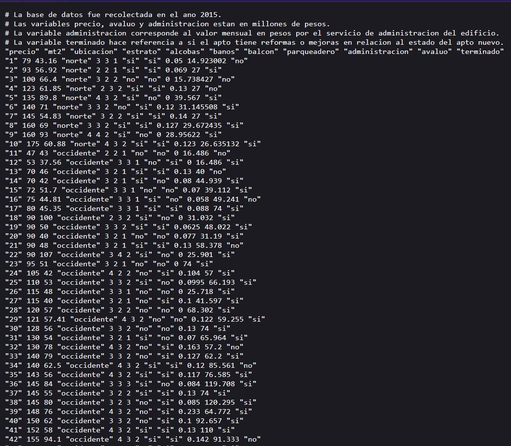

Por lo que se procedió a generar un archivo JSON almacenando todos los registros de los apartamentos del repositorio.
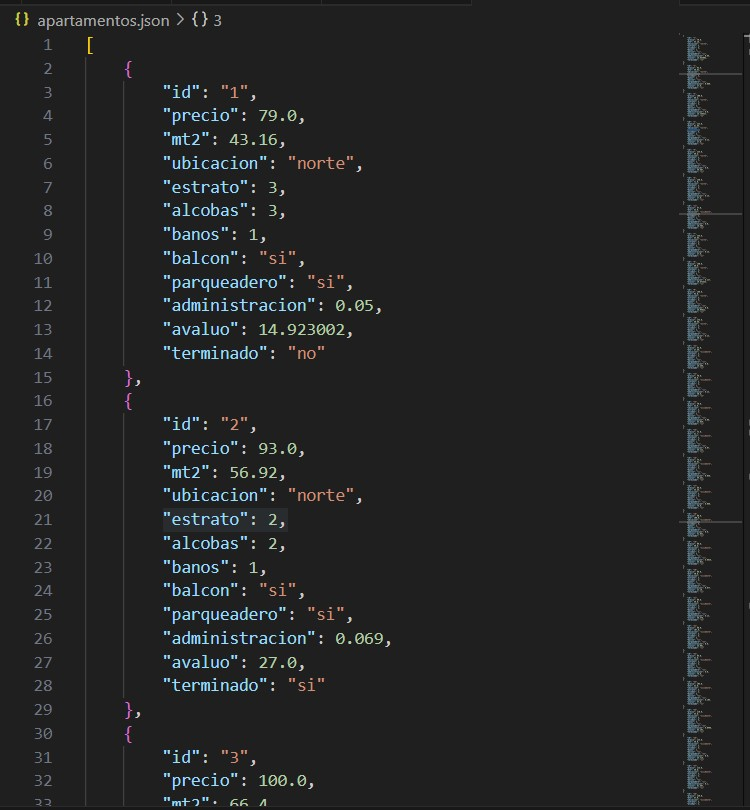
### Python
Por medio de Python, se implementó una API sencilla utilizando Flask. El objetivo principal fue leer un archivo en formato JSON y exponer los datos a tráves de una ruta API para su posterior procesaminto en JavaScript. A continuación, se describen los componentes clave del código y las imágenes adjuntas:

#### Flask
En la siguiente imagen, se muestra la instalación de Flask CORS, una extensión que permite que la API sea accesible desde diferentes dominios. Este es una parte importante cuando se trabaja en una aplicación web.

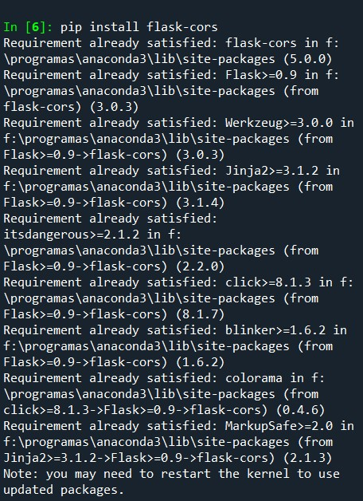

A continuación, se muestra el código empleado en Python:

~~~
from flask import Flask, jsonify
from flask_cors import CORS
import json

app = Flask(__name__)
CORS(app)  
~~~
Como se mencionaba anteriormente, la funcionalidad de Flask CORS se habilita con CORS(app), el cual indica que todas las citas de la API estarán disponibles para solicitudes desde otras fuentes.

El siguiente bloque de código implementa una ruta API (/apartamentos) que utiliza el método GET. Cuando esta ruta es llamada, la función intenta abrir un archivo llamado apartamentos.json. Si el archivo existe y es válido, la función devuelve los datos en formato JSON. Si el archivo no se encuentra o tiene un formato incorrecto, se duevuelve unn mensaje de error con su correspondiente código de estado HTTP (404 o 500)

~~~
@app.route('/apartamentos', methods=['GET'])
def get_data():
    try:
        with open('API/apartamentos.json') as json_file:
            data = json.load(json_file) 
        return jsonify(data)
    except FileNotFoundError:
        return jsonify({"error": "Archivo no encontrado"}), 404
    except json.JSONDecodeError:
        return jsonify({"error": "Error al decodificar el JSON"}), 500

if __name__ == '__main__':
    app.run(debug=True)
    
~~~

Para verificar que Flask este ejecutandose, en la terminal de Visual Studio Code se procedió a ingresar el comando **"phyton nombre-archivo.py"** y al obtener el resultado se visualizó "**Running on http://127.0.0.1:5000**" esto indica que se esta ejecutando correctamente, tal y como se muestra en la siguiente imagen:

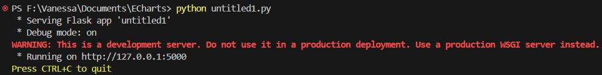

Para verificar que la API este funcionando correctamente, al ingresar al link que nos proporcionó el comando anterior y agregarle la ruta **"/apartamentos"** se deberá visualizar el contenido del archivo JSON.

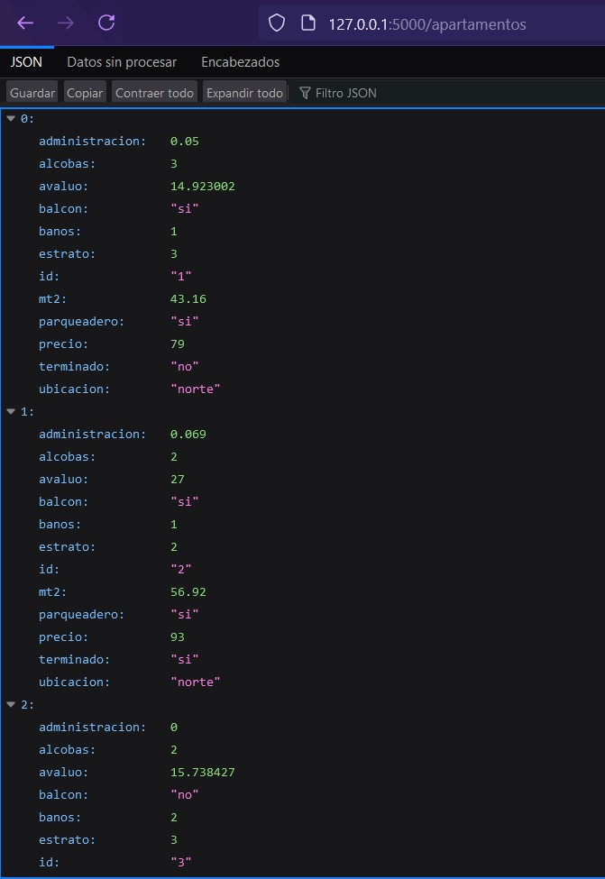
### HTML
#### Creación del archivo HTML
Para visualizar las gráficas en el navegador, en este caso, se utilizó el Lenguaje de Etiquetas de Hipertexto (HTML).

En este bloque de código HTML, se encuentra un selector de opciones que permite al usuario elegir entre diferentes datos para visualizar sus gráficas: ubicación, estrato, precios, y una combinación de alcobas, baños, parqueadero y balcón.  
~~~

    <label for="data-select" class="form-label">Seleccione el dato a visualizar:</label>
    <select id="data-select" class="form-select">
        <option value="ubicacion">Ubicación</option>
        <option value="estrato">Estrato</option>
        <option value="precio">Precios</option>
        <option value="abpb">Alcobas, baños, parqueadero y balcón</option>
    </select>

~~~

El selector se visualiza de la siguiente manera:

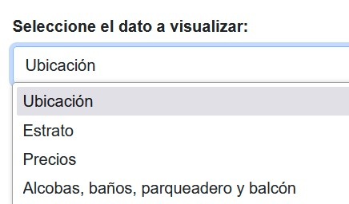
#### Links y Scripts
Para utilizar Bootstrap, se ingresó a su sitio web oficial para obtener el link y el script, los cuales posteriormente se agregaron al HTML.
~~~
<link href="https://cdn.jsdelivr.net/npm/bootstrap@5.3.3/dist/css/bootstrap.min.css" rel="stylesheet" integrity="sha384-QWTKZyjpPEjISv5WaRU9OFeRpok6YctnYmDr5pNlyT2bRjXh0JMhjY6hW+ALEwIH" crossorigin="anonymous">

~~~
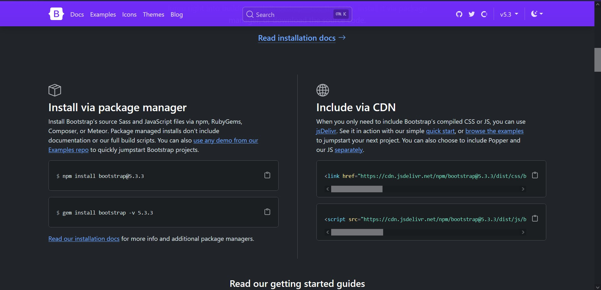

El siguiente link es para acceder a la hoja de estilo
~~~
<link rel="stylesheet" href="styles.css"/>
~~~
El siguiente script incluye la librería ECharts que permite la creación y personalización de gráicos dentro del proyecto.
~~~

~~~

Para obtener el script fue necesario acceder a sus sitio web oficial, el cual indica que se debe acceder al link que proporciona, en el cual se encuentra el script que se mostró anteriormente. 

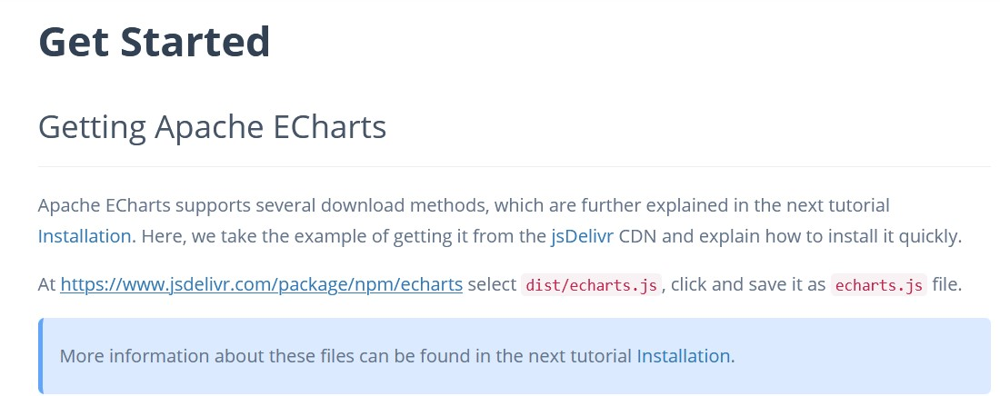
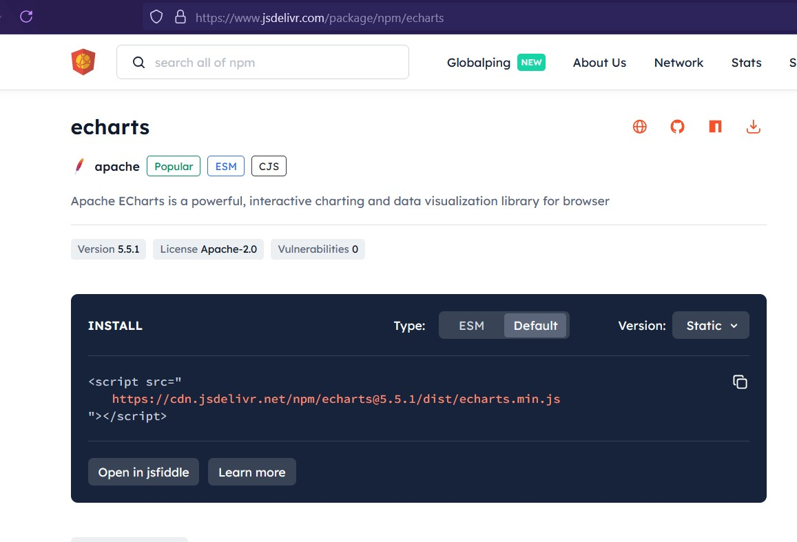

Enlace a un archivo JavaScript (main.js) en donde se define la lógica para la interacción del selector, creación y visualización de las gráficas:
~~~

~~~
A continuación, se muestra el código completo del archivo **index.html**:
#### index.html
~~~
<!DOCTYPE html>
<html lang="en">
    <head>
        <meta charset="UTF-8">
        <meta name="viewport" content="width=device-width, initial-scale=1.0">
        <link href="https://cdn.jsdelivr.net/npm/bootstrap@5.3.3/dist/css/bootstrap.min.css" rel="stylesheet" integrity="sha384-QWTKZyjpPEjISv5WaRU9OFeRpok6YctnYmDr5pNlyT2bRjXh0JMhjY6hW+ALEwIH" crossorigin="anonymous">
        <link rel="stylesheet" href="CSS/styles.css"/>
        <title>ECharts</title>
    </head>
    <body>
        

            

                

                    <label for="data-select" class="form-label">Seleccione el dato a visualizar:</label>
                    <select id="data-select" class="form-select">
                        <option value="ubicacion">Ubicación</option>
                        <option value="estrato">Estrato</option>
                        <option value="precio">Precios</option>
                        <option value="abpb">Alcobas, baños, parqueadero y balcón</option>
                    </select>
                

            

            

                

                    

                

                

                    

                

                

                    

                

                

                    

                

                

                    

                

            

        

        <!-- Bootstrap -->
        
        <!-- Apache ECharts -->
        
        <!-- JS -->
        
    </body>
</html>
~~~
### CSS
#### styles.css
~~~
body {
    background-color: #f8f9fa;
    font-family: 'Arial', sans-serif;
}

.container {
    background-color: #ffffff;
    border-radius: 8px;
    box-shadow: 0 4px 8px rgba(0, 0, 0, 0.1);
    padding: 20px;
}

.chart {
    width: 100%; /* Ancho completo para gráficos */
    min-height: 400px; /* Altura mínima para gráficos */
    border: 1px solid #dee2e6; /* Borde suave */
    border-radius: 8px; /* Bordes redondeados para gráficos */
    background-color: #f1f1f1; /* Color de fondo claro para gráficos */
}

.form-select {
    border: 1px solid #ced4da; /* Borde del select */
    border-radius: 4px; /* Bordes redondeados para el select */
}

.form-label {
    font-weight: bold; /* Hacer la etiqueta más prominente */
}
~~~

A continuación, se describe en general cada sección de la hoja de estilos CSS:
1. ***body***: se proporcionó un fondo de color y una tipografía.
2. ***container***: se proporcionó un fondo blanco para el contenedor,así como bordes redondeados y una sombra suave para darle una apariencia tridimensional.
3. ***chart***: Se le asignó a las gráficas el ancho disponible con una altura mínima de 400px, así como un borde suave, bordes redondeados y un fondo claro.
4. ***form-select***: El selector tiene bordes definidos con un radio de 4px.
5. ***form-label***: se proporcionó una fuente más gruesa para las etiquetas.
### ECharts JavaScript
A continuación, se describen las gráficas utilizadas de ECharts:
| Gráfica                      | Descripción                                                                                                                            |
|------------------------------|----------------------------------------------------------------------------------------------------------------------------------------|
| Gráfica de barras            | Visualiza el número de apartamentos por ubicación. Se configura con **getOptionChart**, que ajusta los ejes *X* (ubicaciones) y *Y* (número de apartamentos). |
| Gráfica de pastel            | Representa la distribución de apartamentos por ubicación, usando **getOptionChart2**. Muestra una proporción visual clara con una gráfica circular. |
| Gráfica de dispersión        | Muestra la relación entre precio y metros cuadrados para cada ubicación, configurando con **getOptionScatterByLocation**.              |
| Gráfica de caja (bloxplot)   | Visualiza la distribución de precios por ubicación, usando **getOptionBoxPlotByLocation**, proporcionando un resumen estadístico visual. |
| Gráfica de rosquilla (donut) | Otra versión de la gráfica circular, pero con un hueco al centro, configurado con **getOptionDonutByLocation**.                        |
| Gráfica de líneas | Representa el precio promedio por número de estratos (desde el mínimo hasta el máximo) de todos los apartamentos, configurado con **getOptionChartByStratum**. |
| Gráfica apilada horizontal   | Compara características como: alcobas, baños, parqueaderos y balcones por ubicación, usando **getOptionStackedHorizontalBar**.         |
#### main.js
~~~
const fetchData = async () => {
  const response = await fetch('http://127.0.0.1:5000/apartamentos');
  return await response.json();
};
~~~
**fetchData** es una función asíncrona que se encarga de obtener los datos desde la API que se generó anteriormente en Python. Después de recibir la respuesta de la solicitud, la función espera que el contenido de la respuesta se convierta en un objeto JavaScriptutilizando el método *.json()*. Finalmente, la función retorna el resultado de la operación *.json()*, que será un objeto con los datos de los apartamentos.
~~~ 
const countApartmentsBySelection = (data, selection) => {
  const options = [...new Set(data.map(item => item[selection]))];
  const countOptions = {};
  options.forEach(option => {
    countOptions[option] = 0;
  });
  data.forEach(item => {
    countOptions[item[selection]]++;
  });

  return {
    options,
    info: options.map(option => countOptions[option]),
  };
};
~~~
**countApartamentBySelection** es una función que toma un conjunto de datos y una selección específica (como: ubicación, estrato, etc.) y cuenta cuántos apartamentos corresponden a cada opción de esa selección.
+ Párametros de la función:
    + ***data***: conjunto de datos que contiene información sobre los apartamentos.
    + ***selection***: string que indica la propiedad que se desea analizar y contar.
+ Funcionamiento:
    + Crea un arreglo *options* que contiene todas las opciones únicas de la propiedad seleccionada, un ejemplo de ello es "ubicación".
    + *data.map()* crea un arreglo con todas las opciones de la propiedad seleccionada y luego usa *new Set()* para eliminar duplicados, para posteriormente convertirse en un arreglo nuevamente.
    + se inicializa un objeto vacío llamado *countOptions* que se utilizará para almacenar la cantidad de apartamentos que corresponden a cada opción.
    + Para cada opción única encontrada en el paso anterior, se agrega una clave en el objeto *countOptions* y se inicializa su valor en 0. Este objeto contendrá la cuenta de cuántos apartamentos hay para cada opción.
    + Se recorre el conjunto de datos *data* y, por cada apartamento se incrementa en 1 el contador correspondiente en *countOptions*, de acuerdo a la opción seleccionada.
    + Finalmente la función retorna un objeto con dos propiedades: options e info.
~~~
//Chart 2
const hideChart2 = () => {
  chart2 = document.getElementById('chart2');
  chart2.style.display = 'none';
};

const showChart2 = () => {
  const chart2 = document.getElementById('chart2');
  chart2.style.display = 'block';
};

//Chart 3
const hideChart3 = () => {
  chart3 = document.getElementById('chart3');
  chart3.style.display = 'none';
};

const showChart3 = () => {
  const chart3 = document.getElementById('chart3');
  chart3.style.display = 'block';
};

//Chart 4
const hideChart4 = () => {
  chart4 = document.getElementById('chart4');
  chart4.style.display = 'none';
};

const showChart4 = () => {
  const chart4 = document.getElementById('chart4');
  chart4.style.display = 'block';
};

//Chart 5
const hideChart5 = () => {
  chart5 = document.getElementById('chart5');
  chart5.style.display = 'none';
};

const showChart5 = () => {
  const chart5 = document.getElementById('chart5');
  chart5.style.display = 'block';
};
~~~
Las funciones hideChart2-5 y showChart2-5 son utilizadas para controlar la visibilidad de una gráfica en específico en la interfaz de usuario.
~~~

const getOptionChart = (options, info) => {
  return {
    title: {text: 'Cantidad de Apartamentos por ubicación' },
    tooltip: {trigger: 'item'},
    xAxis: {name: 'Ubicaciones', type: 'category', data: options},
    yAxis: {name: 'N° de apartamentos', type: 'value'},
    series: [{
      type: 'bar',
      data: info
    }]
  };
};
~~~
***getOptionChart*** genera una gráfica de barras para visualizar la cantidad de apartamentos por ubicación.
+ Parámetros de la función:
    + ***options***: array que contiene las categorías (en este caso, las uicaciones de los apartamentos).
    + ***info***: array que representa la cantidad de apartamentos para cada ubicación correspondiente en el array options.

La función devuelve un objeto que define las opciones de configuración de la gráfica.
+ Configuración:
    + Define el título del gráfico como "Cantidad de apartamentos por ubicación".
    + Configura el comportamiento del *tooltip* que aparece al pasar el cursor sobre los elementos.
    + En el *eje X* se establece su nombre como "Ubicaciones", define el tipo como *category* para indicar que las categorías serán textuales y el *data* se establece como el array *options*, que contiene las ubicaciones.
    + En el *eje Y* se establece su nombre como "N° de apartamentos" y se define el topo del eje como *value*, repesentando valores númericos.
    + En la serie de datos se indica el tipo de gráfica *bar* y se establece como el array *info* que contiene la cantidad de apartamentos por ubicación. Este array se vincula con las categorías del eje X.
~~~
const getOptionChart2 = (options, info) => {
  return {
    title: {text: 'Distribución de apartamentos por ubicación', left: 'center'},
    tooltip: { trigger: 'item' },
    legend: { orient: 'horizontal', top: 'bottom' },
    series: [
      {
        name: 'Apartamentos',
        type: 'pie',
        radius: '50%',
        data: options.map((option, index) => ({
          name: option,
          value: info[index]
        })),
        emphasis: {
          itemStyle: {
            shadowBlur: 10,
            shadowOffsetX: 0,
            shadowColor: 'rgba(0, 0, 0, 0.5)'
          }
        }
      }
    ]
  };
};
~~~
***getOptionChart2*** genera una gráfica de pastel que muestra la distribución de apartamentos agrupados por ubicación.
+ Parámetrosde la función:
    + ***options***: array que contiene las categorías (en este caso, las ubicaciones de los apartamentos).
    + ***info***: array que representa la cantidad de apartamentos para cada ubicación correspondiente en el array options.

La función devuelve un objeto que define las opciones de configuración de la gráfica.
+ Configuración:
    + Establece el título de la gráfica como "Distribución de apartamentos por ubicación" y posiciona el título en el centro horizontalmente.
    + Configura el comportamiento del *tooltip* que aparece al pasar el cursor sobre los elementos.
    + Define la orientación en *legend* como horizontal y lo posiciona en la parte inferior del gráfico.
    + En la serie de datos establece el nombre de la serie como "Apartamentos", indica el tipo de gráfica *pie*, establece el radio de la gráfica en un 50% del espacio disponible, mapea las *options* para crear un array de objetos, donde cada objeto contiene:
        + La ubicación de los apartamentos.
        + La cantidad de apartamentos en esa ubicación, obtenida del array *info* usando el índice correspondiente.
    + Define el estilo de los elementos cuando se pasa el cursor sobre ellos.
~~~
const getOptionScatterByLocation = (data) => {
  const seriesData = {};
  
  data.forEach(item => {
    if (!seriesData[item.ubicacion]) {
      seriesData[item.ubicacion] = [];
    }
    seriesData[item.ubicacion].push([item.precio, item.mt2]);
  });

  return {
    title: { text: 'Relación precio vs metros cuadrados por ubicación' },
    xAxis: { type: 'value', name: 'Precio en millones' },
    yAxis: { type: 'value', name: 'Metros Cuadrados' },
    series: Object.keys(seriesData).map(ubicacion => ({
      name: ubicacion,
      type: 'scatter',
      data: seriesData[ubicacion],
      label: {
        emphasis: {
          show: true,
          formatter: location
        }
      }
    }))
  };
};
~~~
***getOptionScatterByLocation*** genera una gráfica de dispersión que muestra la relación entre el precio y los metros cuadrados de apartamentos agrupados por ubicación.
+ Parámetro de la función:
    + ***data***: array que contiene objetos, donde cada objeto representa un apartamento y tiene propiedades como ubicación, precio y mt2.

Se crea un objeto vacío llamado *seriesData* que se utiliza para agrupar los datos de los apartamentos por ubicación.

Para  la recopilación de datos se itera sobre cada *item* (apartamento) en el array *data*. Verifica si ya existe una entrada en *seriesData* para la ubicación del apartamento (*item.ubicacion*). Si no existe, se inicaliza como un array vacío y por último se agrega un array que contiene el *precio* y los *mt2* del apartamento a la lista de su ubicación correspondiente.

La función devuelve un objeto que define las opciones de configuración de la gráfica de dispersión.

+ Configuración:
    + Se establece el título de la gráfica como "Relación precio vs metros cuadrados por ubicación".
    + *Eje xAxis* se configura como un eje de tipo *value* y se le asigna el nombre "Precio en millones" y para el *eje yAxis* también se configura como un eje de tipo *value* y se asigna el nombre "Metros cuadrados".
    + Se crea la propiedad seriesm que contiene los datos de dispersión para cada ubicación.
    + Se utiliza *Object.keys(seriesData)* para obtener las ubicaciones y se mapea sobre cada ubicación para crear un array de objetos de serie.
    + Para cada ubicación se le establece un nombre, se define el tipo de gráfica como *scatter*, se asigna la lista de datos correspondientes a esa ubicación desde *seriesData* y por último se configura la etiqueta para mostrar al pasar el cursor sobre los puntos con el nombre de la ubicación.
~~~
const getOptionBoxPlotByLocation = (data) => {
  const locations = [...new Set(data.map(item => item.ubicacion))];
  const pricesByLocation = locations.map(ubicacion => 
    data.filter(item => item.ubicacion === ubicacion).map(item => item.precio).sort((a, b) => a - b)
  );

  return {
    title: { text: 'Distribución de precios por ubicación' },
    tooltip: { trigger: 'item' },
    xAxis: { type: 'category', data: locations },
    yAxis: { type: 'value', name: 'Precio en millones' },
    series: [{
      type: 'boxplot',
      data: pricesByLocation.map(precio => [
        Math.min(...precio), 
        precio[Math.floor(precio.length * 0.25)], 
        precio[Math.floor(precio.length * 0.5)], 
        precio[Math.floor(precio.length * 0.75)], 
        Math.max(...precio) 
      ])
    }]
  };
};
~~~
***getOptionBoxPlotByLocation*** genera una gráfica de caja que ilustra la distribución de precios de apartamentos agrupados por ubicación.
+ Parámetro de la función:
    + data: array que contiene objetos, donde cada objeto representa un apartamento y tiene propiedades como ubicacion y precio.

Se utiliza *data.map(...)* para obtener un array de ubicaciones, así como *new Set()* para creae un conjunto único de ubicaciones, eliminando duplicados y finalmente se convierte de nuevo en un array y se almacena en la variable *locations*.

El filtrado y ordenamiento de precios por ubicación se logra iterando sobre cada ubicación en el array locations, para cada ubicación se utiliza *data.filter(...)* para obtener los apartamentos que pertenecen a esa ubicación, después, se mapea sobre los apartamentos filtrados para obtener un array de precios y luego se ordena el array de precios en orden ascendente utilizando *sort((a, b) => a - b). El resultado es un array *pricesByLocation*, donde cada elemento es un array de precios ordenados para cada ubicación.

La función devuelve un objeto que define las opciones de configuración de la gráfica de caja (bloxplot).
+ Configuración:
    + Establece el título de la gráfica como "Distribución de precios por ubicación".
    + Configura el comportamiento del *tooltip* que aparece al pasar el cursor sobre los elementos.
    + *Eje xAxis* se configura como un eje de tipo *category* que toma las ubicaciones como datos y para el *eje yAxis* se configura como un eje de tipo *value* y se asigna el nombre "Precio en millones".
    + Se define la propiedad *series*, que contiene los datos para la gráfica de caja, se establece el tipo de gráfica como *bloxplot* y se mapea sobre *pricesByLocation* para calcular las estadísticas necesarias para la caja de cada ubicación. Para cada array de precios:
        + Se calcula el valor mínimo.
        + Se obtiene el primer cuartil (25%).
        + Se obtiene la mediana (50%).
        +Se obtiene el tercer cuartil (75%).
        + se calcula el valor máximo.
~~~
const getOptionDonutByLocation = (options, info) => {
  return {
    title: { text: 'Distribución de apartamentos por ubicación', left: 'center' },
    tooltip: { trigger: 'item' },
    series: [{
      type: 'pie',
      radius: ['40%', '70%'],
      data: options.map((option, index) => ({
        name: option,
        value: info[index]
      })),
      emphasis: {
        itemStyle: {
          shadowBlur: 10,
          shadowOffsetX: 0,
          shadowColor: 'rgba(0, 0, 0, 0.5)'
        }
      }
    }]
  };
};
~~~
***getOptionDonutByLocation*** genera una gráfica de tipo dona (donut) que ilustra la distribución de apartamentos por ubicación.
+ Parámetros de la función:
    + ***options***: array que contiene los nombres de las ubicaciones.
    + ***info***: array que contiene los valores (número de apartamentos) correspondientes a cada ubicación.

La función devuelve un objeto que define las opciones de configuración de la gráfica de dona.
+ Configuración:
    + Establece el título de la gráfica como "Distribución de apartamentos por ubicación".
    + Configura el comportamiento del *tooltip* que aparece al pasar el cursor sobre los elementos.
    + Se define la propiedad *series*, que contiene los datos para el gráfico tipo pastel y se define *radius* como un array ["40%","70%"], que indica que el gráfico tendrá un radio interno del 40% formando la dona y un radio externo del 70%.
    + La propiedad data se configura usando *options.map(...)*, donde se itera sobre cada opción (ubicación).
    + Para cada option, se crea un objeto que contiene el nombre de la ubicación y el número de apartamentos correspondiente.
~~~
const getOptionChartByStratum = (stratum, prices) => {
  return {
    title: { text: 'Precio promedio por estrato' },
    tooltip: { trigger: 'axis' },
    xAxis: { type: 'category', data: stratum },
    yAxis: { type: 'value', name: 'Precio en millones' },
    series: [{
      type: 'line',
      data: prices
    }]
  };
};
~~~
***getOptionChartByStratum*** genera una gráfica de líneas que muestra el precio promedio de apartamentos por estrato.
+ Parámetros de la función:
    + ***stratum***: array que contiene los diferetes estratos de los apartamentos.
    + ***prices***: array que contiene los precios promedio correspondientes a cada estrato.

La función devuelve un objeto que define las opciones de configuración de la gráfica de líneas.
+ Configuración:
    + Establece el título de la gráfica como "Precio promedio por estrato".
    + Configura el comportamiento del *tooltip* que aparece al pasar el cursor sobre la gráfica, mostrando información sobre los puntos en el eje X (estrato).
    + *Eje xAxis* establece su tipo como *category*, indicando que el eje representa categorías discretas (en este caso, los estratos) y asigna el array *stratum*, que contiene los diferentes estratos a mostrar en el eje X. Para el *Eje yAxis* establece su tipo como *value*, indicando que el eje representa valores númericos continuos y se le asigna el nombre "Precio en millones".
    + Se define la propiedad *series*, que contiene los datos para la gráfica, se establece el tipo como *line* y se le asigna el array *prices*, que contiene los precios promedios correspondientes a cada estrato.
~~~
const getOptionChartByBedrooms = (bedrooms, info) => {
  return {
    title: { text: 'Distribución de apartamentos por número de alcobas' },
    tooltip: { trigger: 'item' },
    legend: { orient: 'horizontal', top: 'bottom' },
    series: [{
      type: 'pie',
      radius: '50%',
      data: bedrooms.map((alcoba, index) => ({
        name: `${alcoba} Alcobas`,
        value: info[index]
      })),
      emphasis: {
        itemStyle: {
          shadowBlur: 10,
          shadowOffsetX: 0,
          shadowColor: 'rgba(0, 0, 0, 0.5)'
        }
      }
    }]
  };
};
~~~
***getOptionChartByBedrooms*** genera una gráfica de pastel mostrando la distribución de apartamentos según el número de alcobas.

Esta gráfica es igual que la de ubicaciones a excepción de que maneja diferentes datos.

~~~
const getOptionStackedHorizontalBar = (data) => {
  const locations = [...new Set(data.map(item => item.ubicacion))];

  const bedroomsByLocation = locations.map(ubicacion => 
    data.filter(item => item.ubicacion === ubicacion).reduce((sum, item) => sum + item.alcobas, 0)
  );
  
  const bathroomByLocation = locations.map(ubicacion => 
    data.filter(item => item.ubicacion === ubicacion).reduce((sum, item) => sum + item.banos, 0)
  );
  
  const parkingLotsByLocation = locations.map(ubicacion => 
    data.filter(item => item.ubicacion === ubicacion && item.parqueadero === 'si').length
  );
  
  const balconiesByLocation = locations.map(ubicacion => 
    data.filter(item => item.ubicacion === ubicacion && item.balcon === 'si').length
  );

  return {
    title: { text: 'Características por ubicación (Alcobas, Baños, Parqueadero, Balcón)' },
    tooltip: { trigger: 'axis', axisPointer: { type: 'shadow' } },
    legend: { top:'10%', orient: 'vertical', left: 'right', data: ['Alcobas', 'Baños', 'Parqueaderos', 'Balcones'] },
    grid: { left: '6%', right: '%', bottom: '3%', containLabel: true },
    xAxis: { type: 'value' },  // Eje X será numérico para las características
    yAxis: { type: 'category', data: locations },  // Eje Y con las ubicaciones
    series: [
      {
        name: 'Alcobas',
        type: 'bar',
        stack: 'total',  // Apilar las series
        label: { show: true },
        data: bedroomsByLocation
      },
      {
        name: 'Baños',
        type: 'bar',
        stack: 'total',
        label: { show: true },
        data: bathroomByLocation
      },
      {
        name: 'Parqueaderos',
        type: 'bar',
        stack: 'total',
        label: { show: true },
        data: parkingLotsByLocation
      },
      {
        name: 'Balcones',
        type: 'bar',
        stack: 'total',
        label: { show: true },
        data: balconiesByLocation
      }
    ]
  };
};
~~~
***getOptionStackedHorizontalBar*** genera una gráfica de barras apliadas horizontalmente proporcionando una comparación visual de las diferentes características de los apartamentos (alcobas, baños, parqueaderos y balcones) por ubicación.

Realiza el conteo o suma del número total de alcobas, baños, parqueaderos y balcones (por separado) por cada ubicación, filtrando solamente los apartamentos donde el *item* sea "si".

La función devuelve un objeto que define las opciones de configuración de la gráfica.
+ Configuración:
    + Establece el título de la gráfica como "Características por ubicación".
    + Configura el comportamiento del *tooltip* que aparece al pasar el cursor sobre los elementos.
    + En *legend* incluye todas las carácteristicas que se apilan.
    + El *eje X* es de tipo *value*, ya que muestra las cantidades de cada característica y el *eje Y* es categórico, mostrando las diferentes ubicaciones.
    + En *series* cada una de las caracteristicas se representa como una barra apilada. Contiene los datos en las series de todas las sumas de las alcobas, baños, parqueaderos y balcones por ubicación.
~~~
const getOptionBarLabelRotation = (data) => {
  const locations = [...new Set(data.map(item => item.ubicacion))];

  const bedroomsByLocation = locations.map(ubicacion => 
    data.filter(item => item.ubicacion === ubicacion).reduce((sum, item) => sum + item.alcobas, 0)
  );
  
  const bathroomByLocation = locations.map(ubicacion => 
    data.filter(item => item.ubicacion === ubicacion).reduce((sum, item) => sum + item.banos, 0)
  );
  
  const parkingLotsByLocation = locations.map(ubicacion => 
    data.filter(item => item.ubicacion === ubicacion && item.parqueadero === 'si').length
  );
  
  const balconiesByLocation = locations.map(ubicacion => 
    data.filter(item => item.ubicacion === ubicacion && item.balcon === 'si').length
  );

  return {
    title: { text: 'Características por Ubicación (Alcobas, Baños, Parqueadero, Balcón)' },
    tooltip: { trigger: 'axis', axisPointer: { type: 'shadow' } },
    legend: { orient: 'horizontal', top: 'bottom', data: ['Alcobas', 'Baños', 'Parqueaderos', 'Balcones'] },
    grid: { left: '3%', right: '4%', bottom: '10%', containLabel: true },
    xAxis: {
      type: 'category',
      data: locations,
      axisLabel: {
        rotate: 45, 
        interval: 0 
    },
    yAxis: { type: 'value' },
    series: [
      {
        name: 'Alcobas',
        type: 'bar',
        label: { show: true },
        data: bedroomsByLocation
      },
      {
        name: 'Baños',
        type: 'bar',
        label: { show: true },
        data: bathroomByLocation
      },
      {
        name: 'Parqueaderos',
        type: 'bar',
        label: { show: true },
        data: parkingLotsByLocation
      },
      {
        name: 'Balcones',
        type: 'bar',
        label: { show: true },
        data: balconiesByLocation
      }
    ]
  };
};
~~~
***getOptionBarLabelRotation*** genera una gráfica de barras agrupadas que muestra, para cada ubicación, las cantidades totales de alcobas, baños, parqueaderos y balcones.

Realiza los mismos cálculos y el mismo parámetro que *getOptionStackedHorizontalBar* por lo que se omitió esa parte de la descripción.

La función devuelve un objeto que define las opciones de configuración de la gráfica.
+ Configuración:
    + Establece el título de la gráfica como "Características por ubicación".
    + Configura el comportamiento del *tooltip* que aparece al pasar el cursor sobre los elementos.
    + En *legend* coloca en la parte inferior las categorías.
    + El *eje X* muestra las ubicaciones rotando las etiquetas a 45 grados y el *eje Y* emuestra el número de características en cada ubicación.
    + Para cada caracteristica en *series*, se crea una serie de barras separada, se le asigna el tipo de gráfica *bar* y cada serie usa los datos calculados previamente para mostrar la suma de características por ubicación.
~~~
const getOptionChartByBathrooms = (bathroom, info) => {
  return {
    title: { text: 'Distribución de apartamentos por número de baños'},
    tooltip: {trigger: 'item'},
    legend: {top: '15%', orient: 'vertical', left: 'left'},
    series: [
      {
        type: 'pie',
        radius: '50%',
        avoidLabelOverlap: false,
        padAngle: 5,
        itemStyle: {
          borderRadius: 10
        },
        label: {
          show: false,
          position: 'center'
        },
        emphasis: {
          label: {
            show: true,
            fontSize: 40,
            fontWeight: 'bold'
          }
        },
        labelLine: {
          show: false
        },
        data: bathroom.map((banos,index) => ({
          name: `${banos} Baños`,
          value: info[index]
        })),
      }
    ]
  };
};
~~~
***getOptionChartByBathrooms*** genera una gráfica de pastel con un diseño más detallado en cuanto a estilo. Es similar a la gráfica de "getOptionChartByBedrooms", la diferencia esta en el diseño y la información que, en vez de alcobas son los baños.
~~~
const initChart = async () => {
  const data = await fetchData();

  const selection = document.getElementById("data-select").value;

  const chart1 = echarts.init(document.getElementById("chart1"));
  const chart2 = echarts.init(document.getElementById("chart2"));
  const chart3 = echarts.init(document.getElementById("chart3"));
  const chart4 = echarts.init(document.getElementById("chart4"));
  const chart5 = echarts.init(document.getElementById("chart5"));

  showChart2();
  showChart3();
  showChart4();
  showChart5();
~~~
***initChart*** se encarga de inicializar y configurar las gráficas en función de la selección realizada por el usuario en un elemento select (data-select). También, utiliza fetchData para obtener los datos desde la API generada en Python (http://127.0.0.1:5000/apartamentos) y luego, según la selección, se generan las gráficas para visualizar la información.

Las gráficas son creadas mediante *echarts.init()* para cada contenedor de la gráfica (chart1, chart2, etc.).

Es importante mencionar que se muestra y ocultan los gráficos según el contexto, con las funciones showChart y hideChart.
~~~
  if (selection === 'ubicacion') {
    const { options, info } = countApartmentsBySelection(data, 'ubicacion');
    chart1.setOption(getOptionChart(options, info));
    chart2.setOption(getOptionChart2(options, info));
    chart3.setOption(getOptionScatterByLocation(data));
    chart4.setOption(getOptionBoxPlotByLocation(data));
    chart5.setOption(getOptionDonutByLocation(options,info));

  } else if (selection === 'estrato') {
    const strata = [...new Set(data.map(item => item.estrato))];
    const averagePrices = strata.map(estrato => {
      const prices = data.filter(item => item.estrato === estrato).map(item => item.precio);
      return prices.reduce((a, b) => a + b, 0) / prices.length;
    });
    chart1.setOption(getOptionChartByStratum(strata, averagePrices));
    hideChart2();
    hideChart3();
    hideChart4();
    hideChart5();
    
  } else if (selection === 'precio') {
    chart1.setOption(getOptionScatterByLocation(data));
    chart2.setOption(getOptionBoxPlotByLocation(data));
    hideChart3();
    hideChart4();
    hideChart5();

  } else if (selection === 'abpb') {
    const { options, info } = countApartmentsBySelection(data, 'alcobas');
    chart1.setOption(getOptionChartByBedrooms(options, info));
    chart2.setOption(getOptionStackedHorizontalBar(data));
    chart3.setOption(getOptionBarLabelRotation(data));
    chart4.setOption(getOptionChartByBathrooms(options, info));
    hideChart5();

  }
};
document.getElementById("data-select").addEventListener("change", initChart);

// Inicializar las gráficas al cargar la página
window.addEventListener("load", () => {
  initChart();
});
~~~
La función setOptions define las opciones de configuración de un gráfico en donde se específica que tipo de gráfico se busca crea.
| Opciones de gráficos | Desglose de opciones |
|----------------------|----------------------|
| 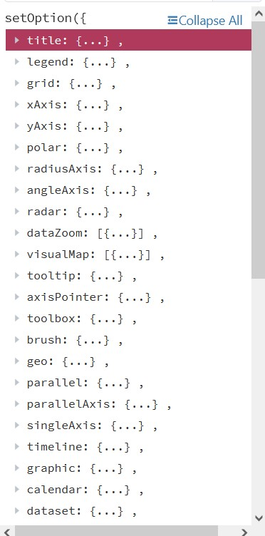 | 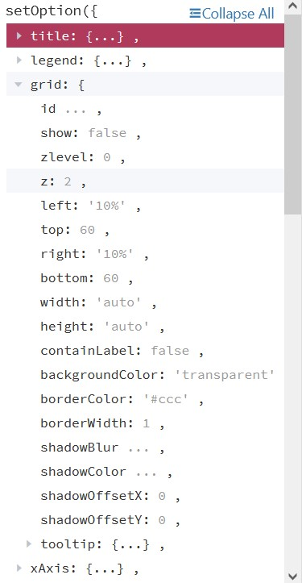

Para finalizar, se muestran capturas de todas las gráficas generadas a partir de la categoría seleccionada:
+ Ubicación
    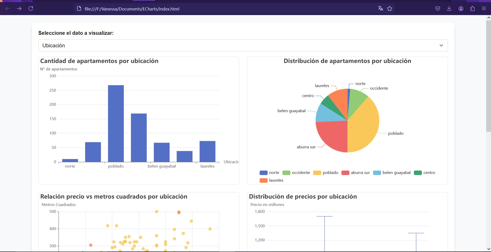
    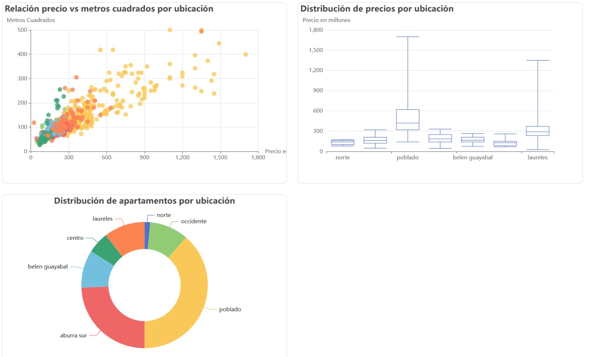
+ Estrato
    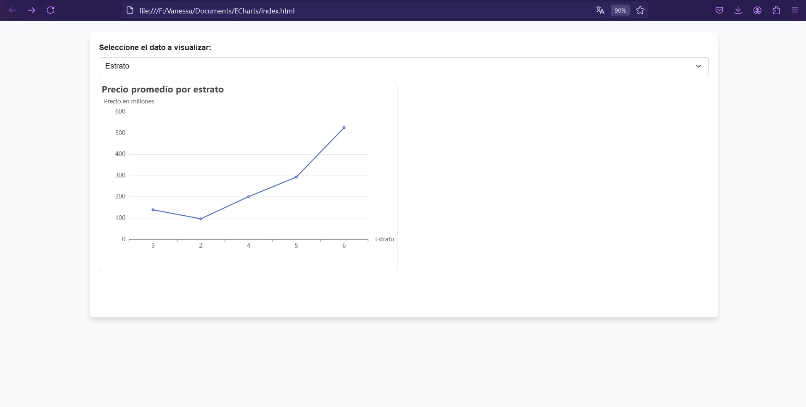
+ Precios
    
+ Alcobas, baños, parqueaderos y balcones
    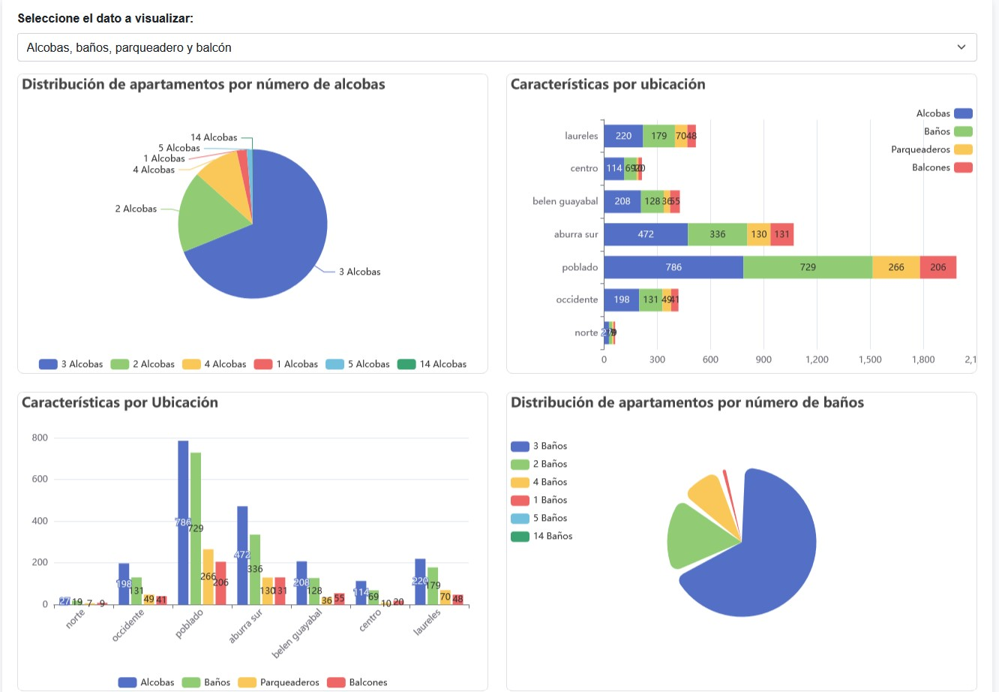

## Conclusión
Considero que Markdown es muy sencillo y cómodo de utilizar a comparación de otros softwares, tal es el caso de Word. Markdown tiene ventaja, ya que es en texto plano y no necesita de un software en específico para que se pueda visualizar de forma clara su contenido.
En cuánto a ECharts, creo que en base a esta actividad me relacioné bastante bien, siento que todavía hay muchas cosas por mejorar, ya que siento que cometí redundancia en ciertas partes de código, espero con el tiempo ir puliendo y aprendiendo todo lo que sea posible.